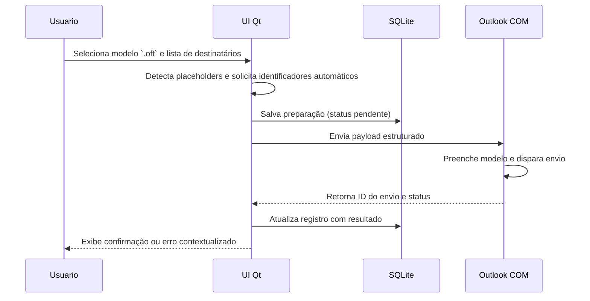

# Blueprint do Assinador Inteligente

## Objetivo do Sistema
O Assinador Inteligente tem como missão simplificar e automatizar o envio de comunicações oficiais por e-mail. Ele prepara mensagens a partir de modelos `.oft`, personaliza dados de destinatários, incorpora anexos relevantes e registra cada envio no repositório local. Dessa forma, reduz o trabalho manual dos times administrativos e garante rastreabilidade completa.

## Personas
- **Analista Administrativo**: Responsável por preparar lotes de e-mails oficiais. Busca agilidade na personalização de modelos e confirmação de entregas.
- **Gerente de Compliance**: Necessita auditar envios, validar logs e garantir que os modelos aprovados estão sendo seguidos.
- **Equipe de TI Suporte**: Mantém a aplicação, ajusta integrações com Outlook e Banco SQLite e monitora falhas operacionais.

## Jornadas Principais
1. **Preparar lote de envios**
   - Seleciona modelo `.oft` aprovado.
   - Importa lista de destinatários com identificadores automáticos.
   - Ajusta campos dinâmicos via interface Qt.
   - Dispara o lote com acompanhamento em tempo real.
2. **Reenviar comunicação específica**
   - Localiza registro no log SQLite.
   - Edita campos necessários.
   - Reexecuta envio individual via Outlook COM.
3. **Auditar histórico**
   - Filtra envios por período e responsável.
   - Exporta relatório detalhado.
   - Confronta dados com a política de comunicação.

## Módulos Centrais e Fluxos de Dados
| Módulo | Responsabilidades | Entrada | Saída | Observações |
| --- | --- | --- | --- | --- |
| UI Qt | Gerencia jornadas do usuário, valida campos dinâmicos e dispara ações | Modelos `.oft`, listas de destinatários, comandos do usuário | Eventos de envio, solicitações de persistência, logs de status | Usa sinais/slots para sincronizar estados.
| Persistência SQLite | Armazena configurações, histórico de envios e metadados de modelos | Eventos da UI, resultados do Outlook | Registros persistidos, consultas para UI | Versão de schema versionada e migrável.
| Automação Outlook via COM | Preenche modelos, adiciona anexos e envia mensagens | Dados normalizados da UI, caminhos de anexos | Status de envio, IDs de mensagens, logs de erro | Executa em thread dedicada para não travar a UI.

Fluxo resumido:
1. UI Qt coleta parâmetros e ativa envio.
2. Dados são normalizados e registrados na camada SQLite.
3. Automação Outlook recebe payload estruturado, aplica no modelo `.oft` e envia.
4. Resultado retorna para UI e persistência atualiza status.

## Integração com Modelos `.oft` e Identificadores Automáticos

### Tabela de Transformação de Dados
| Etapa | Descrição | Responsável | Artefatos |
| --- | --- | --- | --- |
| Carregamento do modelo | Leitura do `.oft` selecionado, parsing de placeholders | UI Qt | Caminho do modelo, placeholders detectados |
| Mapeamento de identificadores | Associação entre colunas da planilha e placeholders | UI Qt + Persistência | Dicionário `{placeholder: valor}` |
| Enriquecimento | Inclusão de anexos e metadados (assunto, prioridade) | UI Qt | Estrutura `MensagemPreparada` |
| Persistência | Gravação da preparação antes do envio | SQLite | Tabela `envios` com status `pendente` |
| Execução de envio | Preenchimento do modelo e acionamento do COM | Automação Outlook | E-mail enviado, ID do Outlook |
| Atualização de status | Registro final com `sucesso` ou `falha` e mensagem de erro | SQLite | Tabela `envios` atualizada |

### Diagrama de Sequência (Mermaid)

### Identificadores Automáticos
- São gerados a partir de chaves únicas da planilha (ex.: matrícula, CPF).
- UI Qt valida se todos os placeholders possuem correspondência antes do envio.
- Falhas de correspondência são tratadas com mensagens amigáveis e logs detalhados.
- Persistência garante unicidade por lote, evitando envios duplicados.

## Boas Práticas
- Versionar modelos `.oft` aprovados e controlados pelo Compliance.
- Implementar testes de integração simulando o Outlook COM em ambiente controlado.
- Monitorar filas de envio e oferecer cancelamento amigável.
- Fornecer relatórios de auditoria exportáveis em CSV e PDF.
